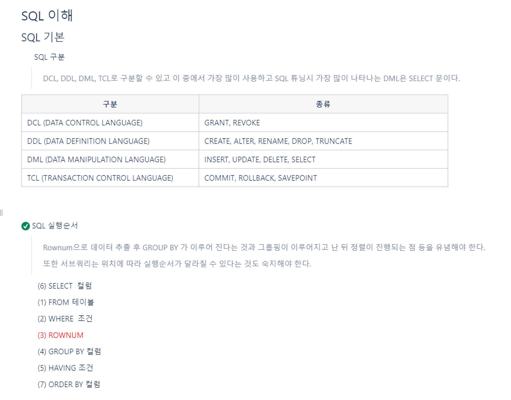
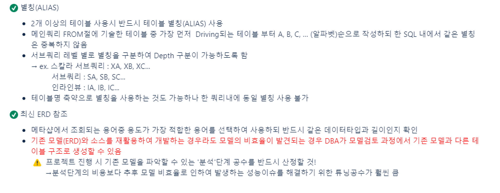
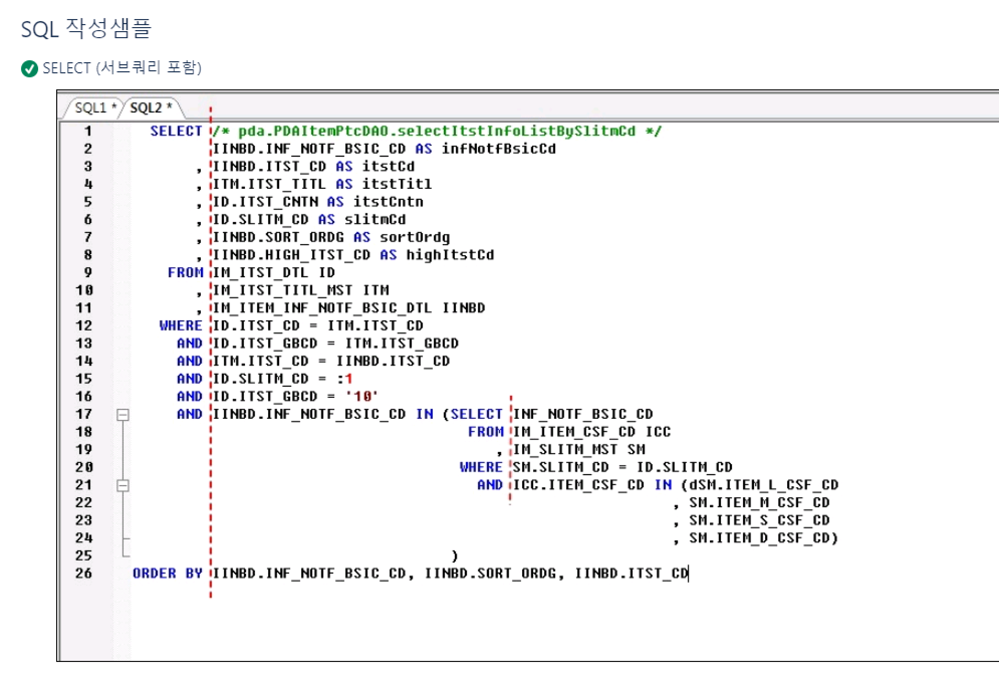
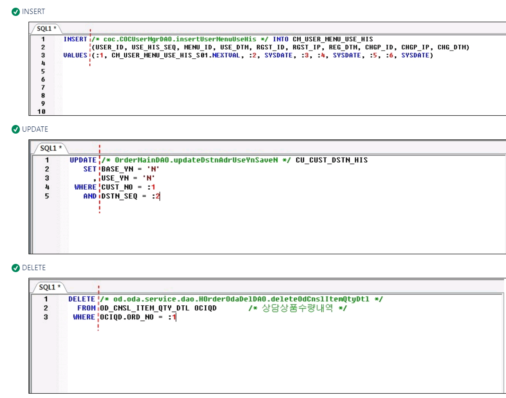

# 1. Overloading vs Overriding

## 오버로딩 (Overloading)
 이름의 함수를 여러 개 정의하고, 매개변수의 유형과 개수를 다르게 하여 다양한 유형의 호출에 응답하게 한다.

 

### 실행결과

 

예제에서와 같이 test 라는 같은 이름의 메소드를 여러개 정의하고 매개변수만 변경하여 선언했을 때, 호출 매개변수에 따라 매칭되어 함수를 실행시킨다.

## 2. 오버라이딩 (Overriding)

상위 클래스가 가지고 있는 멤버변수가 하위 클래스로 상속되는 것처럼 상위 클래스가 가지고 있는 메소드도 하위 클래스로 상속되어 하위 클래스에서 사용할 수 있다. 하지만, 하위 클래스에서 메소드를 재정의해서 사용할 수 있다.

상속 관계에 있는 클래스 간에 같은 이름의 메소드를 정의하는 기술을 오버라이딩(Overriding) 이라고 한다.

### 실행결과

## 3. 오버로딩(Overloading)과 오버라이딩(Overriding) 성립조건

2. getter setter

<강의>

# 1강
1. 아파치 톰켓 설치
2. 바탕화면 JSP에다가 옮겨서 
   
sudo /Library/Tomcat/bin/startup.sh
sudo /Library/Tomcat/bin/shutdown.sh

이렇게 실행 할 수 있지만 우리는 이클립스 연동해서 톰켓을 켤 것입니다.

3. BBS 프로젝트를 만들때 톰켓 버전 및 이클립스와 연동을 시켜준다.

# 2강
1. 부트스트랩 설치
2. login.jsp 코딩

# 3강
1. Mysql 설치 및 테이블 생성
2. User 패키지를 생성한다음 그 안에서 mysql에서 데이터를 전송한 것을 담기 위한 틀을 만들기
3. JSP 서버에서 사용할 수 있는 getter setter를 만들어 준다. 
4. 한명의 데이터를 다룰 수 있는 java beans가 완성

# 4강
1. 이제 실제로 로그인기능을 구현
2. JSP에서 회원 데이터베이스 테이블에 접근 할 수 있도록 DAO라는 것을 만들어 준다.
3. DAO는 데이터베이스 접근 객체의 약자로서 실질적으로 데이터베이스에서 회원 정보를 불러오거나데이터베이스에 회원 정보를 넣고자  할떄 사용됩니다.

Connection 데이터베이스에 접근 할 수 있는 하나의 객체를 의미한다.
preparedStatement 
Resultset 정보를 담을 수 있는 객체

